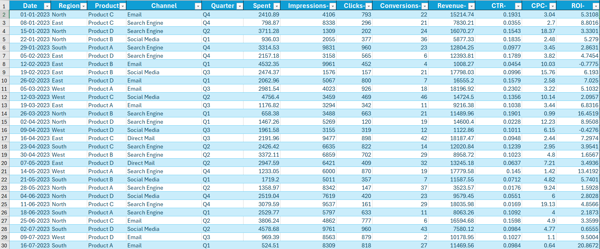
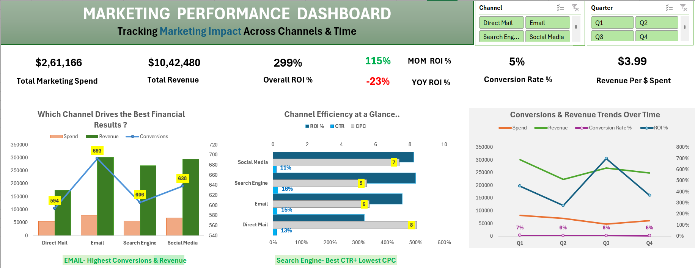

# Marketing Performance Analysis Dashboard

Excel dashboard analyzing marketing performance across channels, products, and regions to evaluate spend efficiency, ROI, and conversion impact.

---

##  Project Overview
This project simulates a real‑world **marketing analytics case** using campaign data.  
It includes **4 dashboard pages**:
1. **Overview Page** – Overall marketing performance summary  
2. **Regional Performance Analysis** – For Regional Marketing Managers  
3. **Product Performance Analysis** – For Product Managers  
4. **Channel Performance Analysis** – For Digital Marketing Team  

Each page provides drill‑down insights on spend, revenue, ROI, conversion rate, CTR, and CPC.

---

##  Problem Statement
Marketing teams need visibility into how different **channels, products, and regions** contribute to revenue and ROI.  
The goal is to identify **high‑performing segments** and optimize spend allocation for better efficiency and conversions.

---

##  Dataset
- **Fields:** Date, Region, Product, Channel, Quarter, Spend, Revenue, Impressions, Clicks, Conversions, CTR, CPC, ROI, Conversion Rate  
- **Source:** Simulated marketing campaign dataset (Excel)  

### Preview

---

##  Tools & Skills
- Microsoft Excel (Pivot Tables, Charts, KPI Cards, Slicers)  
- Dashboard Design & Storytelling  
- KPI Identification & Dimensions Mapping
- Data Visualization & Analysis Skills  

---

##  Methods
- Built **Pivot Tables** for Spend, Revenue, Conversions, ROI, CTR, CPC  
- Created **calculated fields** for ROI %, Conversion Rate %, Revenue per $ Spent  
- Used **slicers** for filtering (Region, Product, Channel, Quarter)  
- Designed **KPI cards** for Spend, Revenue, ROI, Conversion Rate, CTR, CPC  
- Applied **charts**:
- **Dashboard layout** for stakeholder review  
 
---

##  Key Insights
- **Email Channel** drives the **highest conversions and revenue**.  
- **Search Engine** delivers the **best CTR and lowest CPC**, making it most cost‑efficient.  
- **Product C** achieves the **highest ROI (365%)** and best return per $ spent ($4.65).  
- **East Region** performs most efficiently with **ROI 342%** and **Revenue per $ Spent $4.42**.  
- **Overall ROI:** 299% with consistent 5% conversion rate across all segments.  
- **Quarterly trend:** ROI peaked in Q3 while YOY ROI dropped slightly (‑23%), indicating seasonal performance variation.

---

##  Dashboard Features
- **Overview Page:** Spend, Revenue, ROI %, Conversion Rate %, CTR, CPC, and trend analysis.  
- **Regional Performance Page:** Spend vs Revenue, ROI %, Conversions %, Efficiency ($ per $ spent).  
- **Product Performance Page:** ROI %, Conversion %, Return per $ Spent across products.  
- **Channel Performance Page:** CTR & CPC combo chart, ROI %, Conversion %, Spend vs Revenue comparison.

### Dashboard Overview (Performance Summary)

---

##  How to Use This Project
1. Download the repository.  
2. Open `Marketing_Performance_Analysis.xlsx` in Excel.  
3. Go to the Dashboard Worksheet. 
4. Use slicers to filter by Region, Product, Channel, or Quarter.  
5. Explore KPI cards and charts for insights.

---

##  Result & Conclusion
- **Result:** The dashboard provides a unified view of marketing performance across dimensions, helping identify top‑performing channels, products, and regions.
-  
- **Final Recommendations:**  
  - Allocate more budget to **Search Engine** and **Email** channels for higher ROI and conversions.  
  - Focus on **Product C** and **East Region** for efficiency gains.  
  - Monitor **CPC and CTR** trends to maintain cost‑effectiveness.  
  - Address declining YOY ROI by optimizing underperforming regions and channels.

---

##  Future Work
- Extend analysis with Power BI/Tableau for interactive visuals.  
- Integrate SQL backend for automated data refresh.  
- Add predictive modeling for ROI and conversion forecasting.  
- Include campaign‑level segmentation for deeper insights.

---

##  Author & Contact
**Ankita Sharma**
- Aspiring Business Analyst 
- Email: ankita.analysis@outlook.com
- [LinkedIn](http://www.linkedin.com/in/ankitaa-s)
- [GitHub](https://github.com/AnkitaAnalysis)
